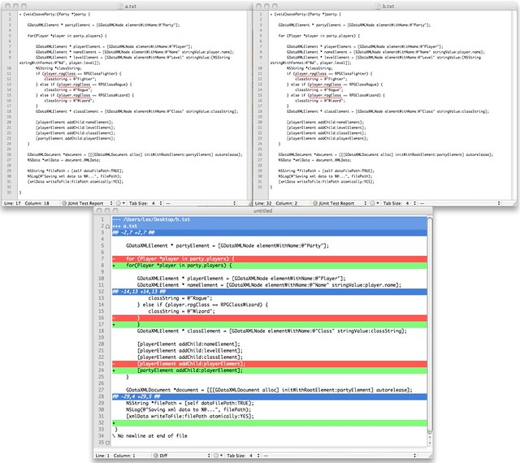

So I've been hard at work again today going through a some iOS tutorials.

Making silly mistakes as usual but hey, best way to learn.

Ran an app and wasn't getting the results I need so I tracked down where it was, couldn't figure it out so copied the solution code into my code, ran it and it worked. Clearly I can't copy from a webpage into Xcode.

Looked at the code, compared it, compared it line by line, looked at it again and still couldn't work it out.

So this got me thinking there must be file comparison tools out there.

I did a quick search on google and there are many but I didn't want to download any, there must be an online solution. I found a blog that suggested using [Google Docs](https://docs.google.com/), create a new doc, paste in the code, save it,  delete the code, paste in the second lot of code, save it,  now click on File -> See revision history. Now this should show up the changes, wasn't quite what I wanted, unless I was looking at it wrong, but may come in useful somewhere down the line.

Next I found it could be done in the terminal.

Comm a.txt b.txt

The result was quite complex looking as I haven't worked in the terminal for a few years, should probably get back there as it is very powerful and much quicker than windows based alternatives, although they have their place. I think the columns the text was in denoted whether it was the same or not depending on the file.

Next I did a quick search for it in Textmate and there it was in a bundles - **Bundles -> Diff**

Hazarr saved both versions, sample and my incorrect attempt, **Bundles -> Diff -> Document with Arbitrary file ...** and there appears a colourful version showing what is different.

Guess what, I copied a line wrong and couldn't see for looking!

Serves me right for copying the initial \[playerElement addChild:nameElement\]; and only changing the RHS and not checking the LHS.

Well this lesson has taught me a few new things in different programs so has had some use.
