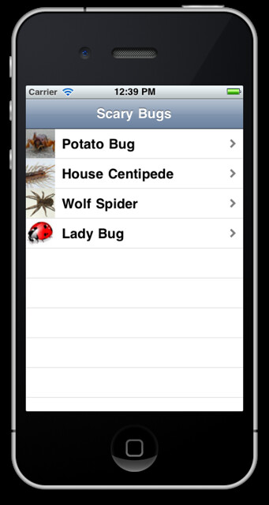

Just finished the [first](http://www.raywenderlich.com/1797/how-to-create-a-simple-iphone-app-tutorial-part-1) tutorial on Ray Wenderlich's excellent [website](http://www.raywenderlich.com/).

This one started adding a table view of bugs with a thumbnail image:

Can't wait to work on more of them.

Links: [http://www.raywenderlich.com/](http://www.raywenderlich.com/) [http://www.raywenderlich.com/1797/how-to-create-a-simple-iphone-app-tutorial-part-1](http://www.raywenderlich.com/1797/how-to-create-a-simple-iphone-app-tutorial-part-1)
