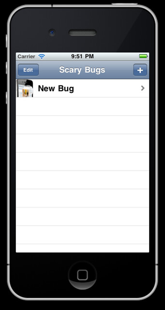
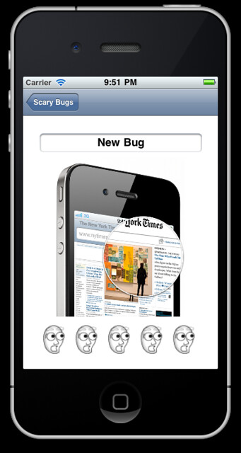

So the next chapter in the tutorials by Ray Wenderlich has taught me how to save data to the device so it will be shown next time I open the app.

Looking forward to using this in further projects.

Links: [http://www.raywenderlich.com/](http://www.raywenderlich.com/) [http://www.raywenderlich.com/1914/how-to-save-your-app-data-with-nscoding-and-nsfilemanager](http://www.raywenderlich.com/1914/how-to-save-your-app-data-with-nscoding-and-nsfilemanager)
