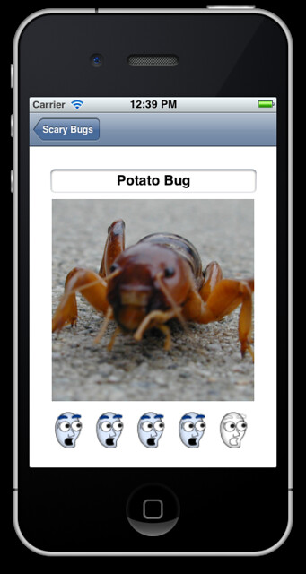

Completed Part 2/3 of the Scary Bugs tutorial.

Added the detail view this time so you could see bug, rate it and change it's name.

Made a silly mistake and copied a few lines of code, forgot to re-name a few variables so the rating didn't work, didn't take long to realise though. Lesson learned hopefully :P

Links: [http://www.raywenderlich.com/](http://www.raywenderlich.com/) [http://www.raywenderlich.com/1845/how-to-create-a-simple-iphone-app-tutorial-part-2](http://www.raywenderlich.com/1845/how-to-create-a-simple-iphone-app-tutorial-part-2)
