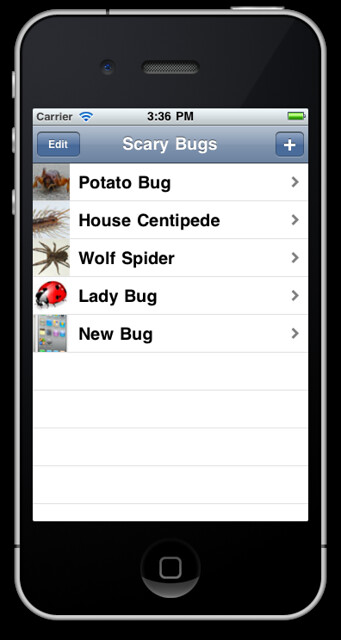
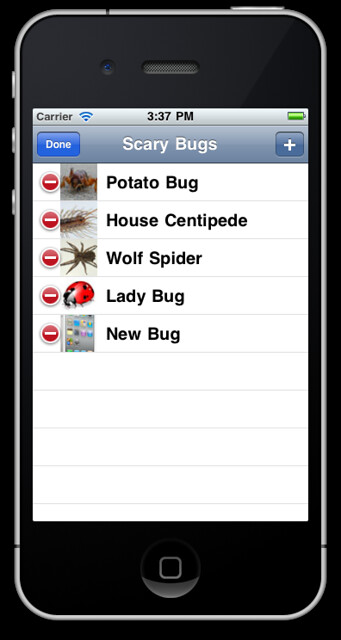
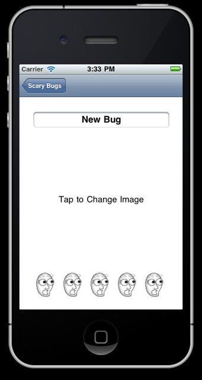

So that's part 3 completed.

I can now delete bugs, add new ones and amend the details.

 

There is a loading screen to inform the user that the program is busy and hasn't crashed.

Next up is saving the data.

Links: [http://www.raywenderlich.com/](http://www.raywenderlich.com/) [http://www.raywenderlich.com/1888/how-to-create-a-simple-iphone-app-tutorial-part-33](http://www.raywenderlich.com/1888/how-to-create-a-simple-iphone-app-tutorial-part-33)
