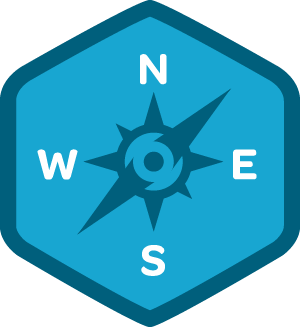

So I've finally started the [iOS5 Foundations](http://teamtreehouse.com/library/ios-5-foundations/) section and produce the code myself, always better than just watching it and assuming I'm taking it in.

 [Automatic Reference Counting](http://teamtreehouse.com/library/ios-5-foundations/automatic-reference-counting) \[DONE\]

 [Storyboards](http://teamtreehouse.com/library/ios-5-foundations/storyboards) \[DONE\]

 [Web View](http://teamtreehouse.com/library/ios-5-foundations/web-view) \[DONE\]

 [Core Data](http://teamtreehouse.com/library/ios-5-foundations/core-data) \[DONE\]

 [Notifications](http://teamtreehouse.com/library/ios-5-foundations/notifications) \[In Progress\]

 [Appearance](http://teamtreehouse.com/library/ios-5-foundations/appearance)

Can't remember how much of  [iOS4 Foundations](http://teamtreehouse.com/library/ios-4-foundations/) I completed but a lot has changed in Xcode since they were produced and others have found it hard to follow. Might go back and re-do at some point if needed.

There's a great community on the [fb group](https://www.facebook.com/groups/164031216987291/) if help is needed.

Just working on a pun app atm.
