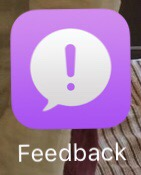

Signed up for the Public beta, shouldn't it be this easy for devs or am I just being lazy?

https://beta.apple.com/

You install a certificate, which then requires a restart, really!   You're advised to make a backup.

Archive an iOS backup with iTunes

https://support.apple.com/HT203282

Then you can install the update over the air (OTA), very simple.

It installs a nice Feedback app:

             
