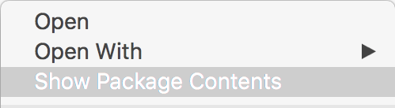

I'm currently creating a game [Movem](https://alexhedley.wordpress.com/category/movem/), and I wanted to add some [Game Center](https://developer.apple.com/game-center/) achievements. I'd done this before in another app I'm making for [Kernowland Quizzes](http://www.jacktrelawny.com/keyquizzes.html) (still in development). There are only a couple of achievements there so wasn't much hassle to create them manually but here I want 1 for each of the 50 levels. This would be a big pain to do.

\[gallery ids="525,524,526" type="rectangular"\]

So I turned to twitter and asked [@KrauseFx](https://twitter.com/krausefx) as I thought he might know.

<blockquote class="twitter-tweet">
<a href="https://twitter.com/AlexHedley">@AlexHedley</a> You can also use iTunes Transporter as far as I know
— Felix Krause (@KrauseFx) <a href="https://twitter.com/KrauseFx/status/718526581950427136">April 8, 2016</a></blockquote>Researching a little I found the app should be in either Xcode or App Transporter. Some SO answers said it was under the MacOS folder but I found it to be now just under itms in the Contents folder.

/Applications/Xcode.app/Contents/Applications/Application Loader.app/Contents/MacOS/itms/ bin => /Applications/Xcode.app/Contents/Applications/Application Loader.app/Contents/itms/bin

Now to find some information about the app itself, lets look to [iTunesConnect](https://itunesconnect.apple.com/) [Resources and Help](https://itunespartner.apple.com/en/apps/overview) under [Apps](http://itunespartner.apple.com/en/apps/guides).

Open the terminal and navigate to the above folder:

./iTMSTransporter -m diagnostic

Next we want to download the information we have on an app so we can use the lookupMetadata flag.

./iTMSTransporter -m lookupMetadata -u # -p # -apple\_id # -subitemtype GameCenterAchievement -destination "#"

Replace the #s with your actual inputs.

This will download a file "_AppleID_.itmsp", if you double click this it will open in Application Loader, you don't want this, instead Right+Click and Show Package Contents:

There's a file called "metadata.xml", open this in your editor of choice, Xcode works fine since it's just XML.

I'm interested in the Game Center info so scroll down:

<game\_center>
    <achievements>
        ...
    </achievements>
</game\_center>

Within here are a couple of achievements I've already created, from research errors can occur if you remove these and re-upload so either leave them in and only make additions to the file or remove them from iTunesConnect and run lookupMetadata again.

I needed at least one already created so I had a template to work with.

I created a playground as this would be the quickest way to create what I needed

for i in 1...50 {
    print(blah \\(i))
 }

Now I just needed to replace the number with \\(i) in all the places necessary and show the console.

\[gist 06bab62bee6402d97f3eb3c5cf6db9d4/\]

Copy and paste that back into the "metadata.xml" and I'm ready to upload.

First thing to do is **verify** the file.

./iTMSTransporter -m verify -f "#/\[AppleId\].itmsp" -u # -p #

Now I can **upload**.

./iTMSTransporter -m upload -f "#/\[AppleId\].itmsp" -u # -p #

There was one thing that was missing, the image file:

ERROR: The file Game\_20Center\_20Level.png is from the list of files requested by Apple, but it was not found locally.

To fix this I just renamed the file I'd uploaded in iTunesConnect to match the above and added it to the PackageContents folder and all was good.

I'd originally tried the "lookupMetadata" without the -subitemtype flag but got an error when trying to upload,

ERROR ITMS-10001: "Multiple items in this package use the same vendor ID. Use unique vendor IDs for the items \[leaderboard, achievement\] and resubmit the package." at Software/SoftwareMetadata

...

<main> DBG-X: The error code is: 1102

 

* * *

Learn more about Game Center in Chapters 25 and 26 of [2D iOS & tvOS Games by Tutorials](https://www.raywenderlich.com/store/2d-ios-tvos-games-by-tutorials) from Ray Wenderlich.

Links [https://twitter.com/AlexHedley/status/718513616132161536](https://twitter.com/AlexHedley/status/718513616132161536) [https://twitter.com/KrauseFx/status/718526581950427136](https://twitter.com/KrauseFx/status/718526581950427136)

[http://itunespartner.apple.com/en/apps/guides](http://itunespartner.apple.com/en/apps/guides) [https://help.apple.com/itc/transporteruserguide/](https://help.apple.com/itc/transporteruserguide/)

[http://stackoverflow.com/questions/11205998/ios-game-center-achievement-upload](http://stackoverflow.com/questions/11205998/ios-game-center-achievement-upload) [http://bou.io/UploadingScreenshotsWithITMSTransporter.html](http://bou.io/UploadingScreenshotsWithITMSTransporter.html) [http://www.cyrilchandelier.com/having-fun-with-itmstransporter](http://www.cyrilchandelier.com/having-fun-with-itmstransporter)

### What's New in iTunes Connect

WWDC 2013 - [Session 306](https://developer.apple.com/videos/play/wwdc2013/306/) - iOS, OS X

[http://web.archive.org/web/20150216153821/http://realmacsoftware.com/blog/mastering-itunes-connect-transporter](http://web.archive.org/web/20150216153821/http://realmacsoftware.com/blog/mastering-itunes-connect-transporter)

- [https://github.com/realmacsoftware/RMConnecter](https://github.com/realmacsoftware/RMConnecter)
