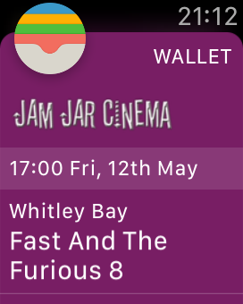
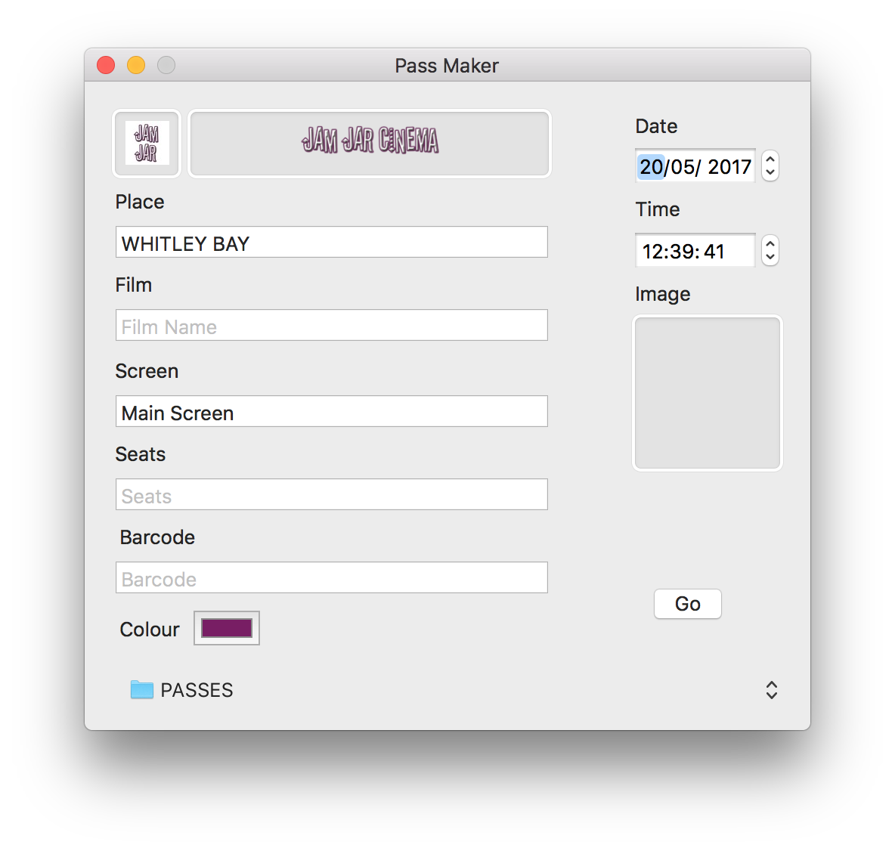

My local cinema is Awesome!

- [http://www.jamjarcinema.com](http://www.jamjarcinema.com)

I want to create passes to keep a memento of the films I've seen. I order online so don't get ticket stubs from the venue and I like having a digital copy, like CineWorld does.

 

There are a number of websites which allow you to make Wallet Passes.

I've recently tried PassSlot ([https://www.passslot.com](https://www.passslot.com)).

It has a free tier which allows you to create 1 PassID, multiple templates, and a set limit of passes, which is all I need.

It has an SDK which is great.

- [https://github.com/passslot/passslot-ios-sdk](https://github.com/passslot/passslot-ios-sdk)

I created my Template with variables for the various pieces of information and now I have an iOS app which allows me to fill in the values, pick an image and create a pass.

It uses the iTunes Artwork Finder from Ben Dodson.

- [https://bendodson.com/projects/itunes-artwork-finder/](https://bendodson.com/projects/itunes-artwork-finder/)

\[gallery ids="1003,1004,1005,1006,1007,1008,1009,1010" type="rectangular"\]

Wallet

- [https://developer.apple.com/wallet/](https://developer.apple.com/wallet/)
- [https://developer.apple.com/reference/passkit](https://developer.apple.com/reference/passkit)

* * *

The PassSlot API is available on 'mashape'

The documentation mentions

> Other Platforms - The PassSlot API is also available through mashape. They have client libraries for Node, Ruby, Java, .NET, Windows 8

On the marketplace

https://market.mashape.com/passslot/passbook

There is a button for open in Paw. I can't get it to work at the moment.

* * *

I'd started making a Mac app to create Wallet Passes.

I followed the RW tutorials on PassKit but my PHP was rusty so never got that side working.

I got the local one working which used the sign tool and created all the files

- pass.json
- manifest.json
- .pkpass
- etc

But when I tried to add them to my phone I ran into issues, I raised a bug will Apple and they are working on something.

The pass has to be served over SSL.

I made my own Contact Card: [https://alexhedley.wordpress.com/2014/12/29/passbook/](https://alexhedley.wordpress.com/2014/12/29/passbook/)
