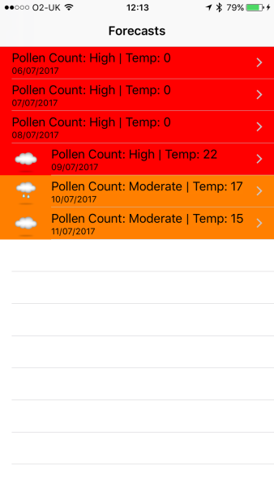
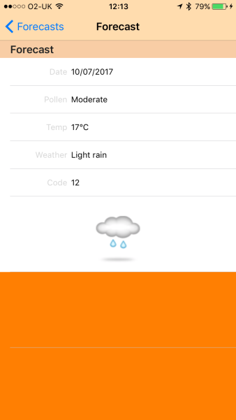

I want a today Widget to show pollen count.

I downloaded:

Clarityn’s Pollen Forecast UK by Bayer HealthCare AG

https://appsto.re/gb/tPFfw.i

They have a website

http://www.claritynallergy.co.uk/allergyforecast/?zip=X

It doesn't have the Widget I wanted so I started looking for an API.

* * *

**POST** http://www.claritynallergy.co.uk/webservice/allergyforecast.php

Header

Accept: application/json

Body

_Form URL-Encoded_

zip=NE11EE

Response

"{\\"Durham & Newcastle\\":{\\"1499515201\\":{\\"precipitation\\":8,\\"maxTemp\\":21,\\"minTemp\\":16,\\"pollenLevel\\":\\"H\\",\\"humidity\\":83,\\"windSpeed\\":7,\\"weatherCode\\":7,\\"uvIndex\\":5,\\"pollenType\\":\\"Grass\\"},\\"1499601600\\":{\\"precipitation\\":18,\\"maxTemp\\":18,\\"minTemp\\":15,\\"pollenLevel\\":\\"H\\",\\"humidity\\":80,\\"windSpeed\\":18,\\"weatherCode\\":7,\\"uvIndex\\":4,\\"pollenType\\":\\"Grass\\"},\\"1499688000\\":{\\"precipitation\\":23,\\"maxTemp\\":18,\\"minTemp\\":14,\\"pollenLevel\\":\\"M\\",\\"humidity\\":69,\\"windSpeed\\":11,\\"weatherCode\\":3,\\"uvIndex\\":7,\\"pollenType\\":\\"Grass\\"}}}"

Images

"http://www.claritynallergy.co.uk/static/media/images/claritynallergy/7-trans.png" : 

* * *

I found Benadryl has one.

https://www.benadryl.co.uk/social-pollen-count

* * *

**GET** https://socialpollencount.co.uk/api/forecast?location=\[**LAT**,**LON**\]

Response

{"status\_code":"200 OK","date":"2017-07-02T07:13:47+00:00","forecast":\[{"date":"2017-06-29T08:00:01+00:00","pollen\_count":"Low"},{"date":"2017-06-30T08:00:01+00:00","pollen\_count":"Low"},{"date":"2017-07-01T08:00:01+00:00","pollen\_count":"High"},{"date":"2017-07-02T08:00:01+00:00","pollen\_count":"High","temperature":"18","weather\_code":"01","weather":"Sunny"},{"date":"2017-07-03T08:00:01+00:00","pollen\_count":"High","temperature":"18","weather\_code":"07","weather":"Medium-level cloud"},{"date":"2017-07-04T08:00:01+00:00","pollen\_count":"Moderate","temperature":"14","weather\_code":"12","weather":"Light rain"}\]}

Images

"https://socialpollencount.co.uk/images/content/weather/07.pnp" :

* * *

App: https://itunes.apple.com/gb/app/benadryl-social-pollen-count/id638068252?mt=8

App doesn't exist.

* * *

Progress I've started building my own

   The Widget needs a lot of work but the basis is there, I've built a framework that gets all the data. Now to finish the UI...
